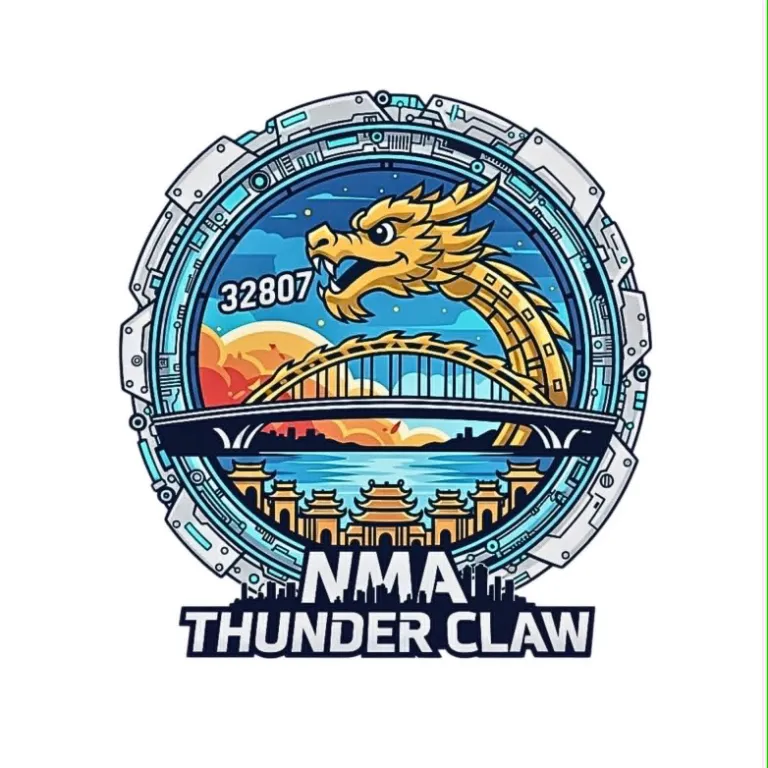
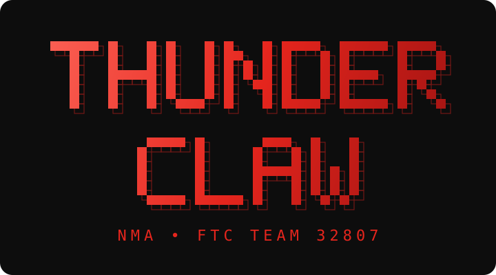

<p align="center">
  
</p>

<p align="center">
  
</p>

# BIOBUZZ Sim 3D (FTC 2026–2027)

A 3D simulation of the FTC BIOBUZZ match: the field is built from FIRST's official CAD file, with 300 Hz ball/HIVE physics, custom-designed robots, programmable AUTO strategies, AprilTag auto-aim, AI bots, an automatic referee, replay + match analysis, bloom graphics, and two-player online play.

## Quick start
Open `biobuzz-sim.html` in Chrome/Edge (an internet connection is required to load three.js r128 from cdnjs and Google Fonts). Online play only works when the page is opened inside Claude (it uses the artifact `room` feature).

## Controls
- By default the robot is driven with a **gamepad** (Xbox, PlayStation, Logitech F310 in X mode). The keyboard is still used for shortcuts (C switches the view, Esc pauses, Delete resets the field in practice mode, etc.).
- To drive with the keyboard: Settings → Controls → "Drive robot with keyboard". Keys ramp up gradually like an analog stick, and turning runs at 60% power (adjustable). Turn off your Vietnamese input method (Unikey/EVKey) when driving with the keyboard, otherwise W A S D get swallowed; the page shows a reminder when it detects one.
- Camera: left-drag to rotate, Shift + drag or right-drag to pan, scroll to zoom, double-click to reset; each view remembers its own camera. Gamepad: pause → "Adjust this camera".

## AUTO strategy
The **AUTO Strategy** menu lets you draw a 30-second program on the field, viewed from the RED driver station (the BLUE side is automatically rotated 180°). Available steps: Go to, Shoot (in place / find a spot), Pick up balls inside a circle, Turn, Wait, Wait until second, PARK. "Test run" runs the program with the real engine (a single robot on the field) and logs the result of each step; "Shot map" highlights the standing positions from which shots score. Choose a program for yourself and for your bot teammate on the Match / Two players / Online screens; share programs with a `BBA1.…` code. The model and program runner live in `ai.js` (`AI.PLAN`, `runPlan`), and the UI is in `autoed.js`.

## Building from source
```
node build.mjs        # bundles src/ into dist/biobuzz-sim.html
```
Bundle order: engine → ai → render → fx → input → audio → replay → hud → ui → autoed → net → app. `src/fieldcad.b64` (the field model) is embedded in the page as a text block `#field-cad`; render.js decompresses it at startup (DecompressionStream). If the browser cannot decompress it, the page falls back to a hand-built field.

## Field from the official CAD file
`tools/fieldcad/field-cad-step.zip` is the **Field CAD (STEP, .ZIP) v26-27.2** file (9/15/2026) downloaded from FIRST's Playing Field Resources page: https://ftc-resources.firstinspires.org/ftc/field

To regenerate `src/fieldcad.b64` (requires Python 3 + `pip install cadquery-ocp pymeshlab fast-simplification numpy scipy`; pymeshlab needs the system library `libopengl0`):
```
cd tools/fieldcad
unzip field-cad-step.zip                 # produces field-cad-step.step (35 MB, AP242)
python3 extract.py field-cad-step.step   # reads the STEP with OpenCASCADE, meshes each part -> proto.pkl
python3 build_asset.py                   # removes screws, decimates cast parts, lays both HIVEs flat, compresses -> src/fieldcad.b64
```
(The paths in both scripts currently point to `/home/claude/...`; edit them for your machine.)

Coordinate system: the CAD is in inches, Y-up, +X toward BLUE, +Z toward the audience, matching the three.js frame in render.js (`three.x = sim.x`, `three.y = sim.z`, `three.z = -sim.y`). The collision dimensions in engine.js (walls, CELL, FLOWER, frame, tape, AprilTag) were checked against the CAD and are annotated where they are declared.

## Files in src/
| File | Contents |
|---|---|
| engine.js | Physics (1/300 s step), Magnus-effect balls, HIVE see-saw, FLOWER (center ring holding NECTAR), robot from spec, motors/battery/flywheel, AprilTag + odometry, referee, scoring |
| ai.js | Bot: A* pathfinding, roles (TIP, FLOWER, defense), PARK, G402/G421 avoidance; team AUTO programs (`AI.PLAN`: normalization, share code, G304/G402 checks, step-by-step runner) |
| render.js | three.js: CAD field (or hand-built fallback), robot built from spec, interpolation between physics steps, per-view adjustable camera, automatic resolution scaling, "Best quality" post-processing (MSAA + bloom) |
| fieldcad.b64 | Compressed CAD field model (166k triangles, 36 carpet seams) |
| fx.js | Sparks when entering the CELL, TIP burst, ball trails, confetti, stand flashes |
| input.js | Gamepad, two-half keyboard (default driving off, ramp-up, Vietnamese IME detection), key binding |
| audio.js | Field sounds, robot sounds |
| replay.js | 30 fps match recording, replay viewer, match timeline chart, field map |
| hud.js | Scoreboard, robot panel, tag camera, results screen |
| ui.js | Menus, robot workshop, settings |
| autoed.js | AUTO strategy editor: field map, step list, test run, shot map, share code |
| net.js | Online play via the artifact room (host runs physics, guest sends joystick input) |
| app.js | Main loop, player control, match setup |
| markup.html, style.css | User interface |

## Testing (optional)
`test/*.mjs` run with Node (`node test/batch.mjs 6`, `node test/plan.mjs`, `node test/flower2.mjs`, `node test/tip.mjs`); `test/*.py` need Playwright + Chromium (`python3 test/auto.py` tests the AUTO editor, camera and controls; `python3 test/cad.py high` captures the CAD field from multiple angles).

---

<div align="center">

**NMA Thunder Claw · FTC Team 32807** · Da Nang, Vietnam

</div>
